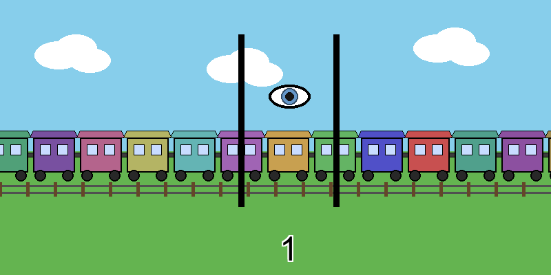

> The Childlike Empress: Bastian. Why don’t you do what you dream, Bastian? 
> Bastian: But I can't, I have to keep my feet on the ground! 
> The Childlike Empress: ... Bastian, please! Save us! 
> Bastian: All right! I'll do it! I'll save you! I will do what I dream! 
>
>The Neverending Story

Infinity seems to be taught as a mysterious concept one encounters already in primary school and that haunts one for a long time... Here I would like to, to a certain degree, demystify infinity, so that its users can feel more at ease applying this concept and somehow get a handle on it. 

In school you were probably taught that you should think of some very large number when you think of infinity or when saying that something is infinite or that you have infinitely many things.[#1] However, this doesn't make any sense and let's have a look at why. 

First, consider what the word infinity actually means. Starting with the word "finite", which has its roots in the Latin word "fīnītus", the past participle of the verb fīnīre, which meant "to limit", "to set bounds" or "to end". 
And since when we say that something is infinite (i.e. translated "not finite"), we mean the opposite of being finite, and so meaning "not bounded". 

Now, let's have a closer look at this. 
Well, finite means that there are finitely many things of something, since whatever basket of strawberries you are given, by the very meaning of the word finite, the number of the strawberies must be bounded, i.e. we can count them, and so we can say that there are five of them, six of them, seven hundred of them, whatever number you can think of.[#2] But now if we said that there are infinitely many of them, it would mean we could not count them, i.e. we cannot put a number on them. And so, if infinity were some huge number, let's say 1000 or whatever number you can think of, well, then we obtained a finite number of these strawberries, i.e. we could say that they are finite, hence not infinite.

Moreover, now, instead of a basket of strawberries consider a set of numbers and if said that there are infinitely many of them, then from the very discussion we just had, well, then regardless which number you pick from the set, there must be a bigger one, which is another way of saying that the set contains __arbitrarily large__ numbers. To make this more precise, we can denote our set by $S$ and say that it contains arbitrarily large numbers whenever given a positive number $N$, there exists a number $x$ in $S$ such that $x$ is bigger than $N$.[ref:LangUndergraduateAnalysis2ndEd1997] 
(An interessted reader may have a look at Serge's _Undergraduate Analysis_ [ref:LangUndergraduateAnalysis2ndEd1997] to see the importance of this notion and before doing so can think about how a set containing arbitrarily small numbers could be defined by restating the above definition for sets containing arbitrarily large numbers.)

__Remark:__
From what we have seen, one could think of infinite as being some kind of a process, which is another way you can understand infinity, although rather imaginative and if you do not like it, just forget it after reading this remark, but since some readers may be inclined this way, I decided to include it here. 
Now, the way we would understand infinity is that we would associate infinity with something that we have a natural understanding of as going forever. Now the first thing that comes to mind is time. And so to make things maybe a little more imaginative, you can think of a train, which has wagons, and you stand next to the railway, and every second there appears a new wagon. And since we assume that time never ceases, there are infinitely many wagons, one new wagon each second, right? Thus, such kind of reasoning would bring infinity closer to being some kind of a process. 

  
  
A visualization of the infinite train concept: wagons passing by over time.

Since we have already some intuitive understanding of infinite, we will go a bit further and show how one can work with infinity in practice in a very convenient way. Moreover, such use is applied in later mathematics exactly in the way we will see below. We just denote infinity symbolically, or if you wish, algebraically, by stating that infinity is the following symbol $\infty$ and we impose certain rules for allowed manipulation of that symbol. Then you can think of it as just some kind of an element or a number for which you have precise rules, which clearly tell you what you can do with this symbol, and that's it. 

It is very similar to the way you can manipulate numbers or you can manipulate with any other objects you already encountered in mathematics. There's nothing special about such a way of thinking, only the rules that you impose make it special. 
Moroever, the rules are intuitive and go as follows:

$\infty + \infty = \infty$, $\infty \cdot \infty = \infty$, $0/\infty = 0$,

$c + \infty = \infty$ for all numbers $c$,

$c \cdot \infty = \infty$ for all numbers $c > 0$.

We do not define the expressions
$0 \cdot \infty$, $\infty / \infty$, $\infty / 0$, $0 / 0$, or $c / 0$ if $c$ is a number. [ref:LangUndergraduateAnalysis2ndEd1997]

As already said and as you can see, these rules are nothing special and they are taken _verbatim_ from Serge Lang's _Undergraduate Analysis_ [ref:LangUndergraduateAnalysis2ndEd1997] and his _Introduction to Algebraic Geometry_[ref:LangIntroductionAlgebraicGeometry2019]. They are stated in the exact same manner as I did here in both books. Thus, an interested reader may continue reading further according to personal taste.

Again, I want to emphasize that this algebraic (or if you wish "manipulative" way of stating things) is very common as, for instance, we can also define a symbol $\sqrt 2$, which is called the square root of $2$ and is often defined as some positive number which if squared is equal to $2$. Hence, the way we defined infinity is nothing unusual.

Last but not least, I want to make the reader aware of the fact that the symbolic description of infinity, we saw above, leads to further and deeper understandings of infinity. To set you on the track, if you take all numbers, (for those who had some mathematics, say real numbers), then we just attach this infinity symbol to the real numbers, and study what happens. However, this understanding is out of the scope of this introductory remarks about infinity, but a reader interested in this direction can consult Lang's book, _The Beauty of Doing Mathematics: Three Public Dialogues_[ref:LangBeautyOfDoingMathematics1985], where within one of the dialogues Serge brings intuitively this understanding of infinity closer to you, even with an illustrative pictorial description.

> “To infinity… and beyond!
>
> Buzz Lightyear in Pixar’s Toy Story (1995)
---

<!-- FOOTNOTES
[1]: Why it is taught at most schools in this way is a mystery to me, especially since the ways of understanding infinity presnted here are definitely not difficult to grasb by school childern.
[2]: Of course it has to match the number of strawberries in your basket ;)
-->
